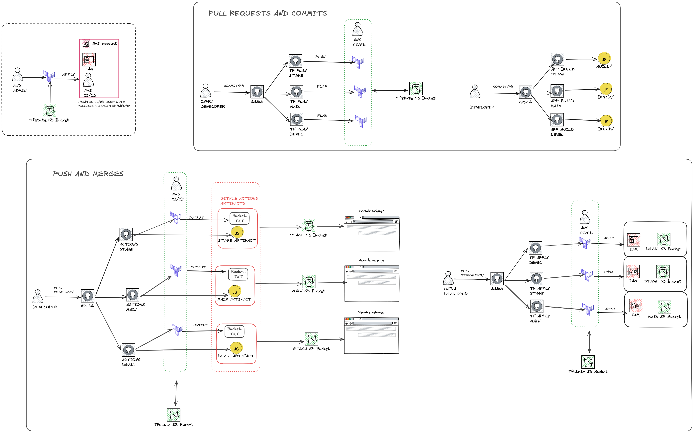

# CI/CD Coding challenge

## Create a full CI/CD environment using github actions to build and deploy a JS application on the internet.

## Solution:
1. Create a AWS CI/CD user with policies to use your Terraform resources.
1. For pull requests and commits:
    1. **app-build-X** Consists of 3 pipelines, 1 for each environment of Dev, Stage and Main. They will do a terraform validate and plan.
    1. **terraform-plan-X** Consists of 3 pipelines, 1 for each environment of Dev, Stage and Main. They will build the artifacts of the JS app.
1. For push and merges:
    1. **terraform-apply-X** Consists of 3 pipelines, 1 for each environment of Dev, Stage and Main. They will do terraform apply to create an S3 bucket, the name of the bucket will be exported as an artifact.
    1. **app-deploy-X** Consists of 3 pipelines, 1 for each environment of Dev, Stage and Main. It fetchs the bucket name from the previous `terraform apply`, in paralell it builds the artifacts of the JS application. Once both stages are done it sync the S3 bucket objects and uploads the new artifacts to deploy the new S3 website.

    